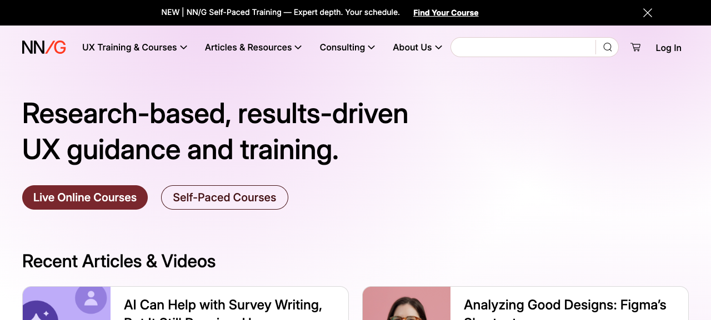

# UI Inspection

## Screenshot

## Page purpose (inferred from UI)

The page is the NN/G homepage. It promotes UX training and consulting, surfaces recent articles and videos, advertises live and self-paced courses, explains certification and team offerings, adds credibility with proof points and client logos, and finishes with newsletter signup plus footer navigation.

## Structural breakdown (top to bottom)

1. `div.banner-sales.paragraph-xs-400`
   Promotional banner with `div.banner-sales__content` and a close button.

2. `header.banner-image.header-rebrand`
   Contains the primary desktop navigation `nav.nav-main.nav-main--rebrand.desktop` and the homepage hero wrapper `div.home-banner-header.ds-wrapper`.

3. `main#main`
   Contains six top-level content groups:
   - `section.homepage-rebranding.recent.ds-wrapper`
   - `div.home-courses-container.ds-wrapper`
   - `section.earn-ux-certification.ds-wrapper`
   - `section.ds-services-cards.ds-wrapper`
   - `section.why-nngroup.ds-wrapper`
   - `section.clients-banner.ds-wrapper`

4. `footer.footer-rebrand`
   Contains `section.top-footer.ds-wrapper`, `section.navigation.ds-wrapper`, and `div.bottom-footer.ds-wrapper`.

5. `button.back-to-top.ds-button-medium.ds-button-gray.label-m-500`
   Floating return-to-top control placed after the footer in the body.

6. Hidden body-level consent UI
   `div.cky-hide.cky-overlay`, `div.cky-hide.cky-consent-container.cky-banner-bottom`, and `div.cky-modal` are present in the DOM but hidden in the captured state.

## Component inventory

### Component: banner-sales

- Source of name:
  class
- Selectors:
  `div.banner-sales`
- Where it appears:
  very top of the page, above the header
- Structure:
  wrapper `div.banner-sales.paragraph-xs-400` with `div.banner-sales__content` for promo text and a sibling close `button` with `aria-label="Close promotion banner"`
- Variants:
  none
- Usage:
  displays a dismissible sitewide promotion
- Repetition:
  single instance

### Component: nav-main

- Source of name:
  class
- Selectors:
  `header > nav.nav-main.nav-main--rebrand.desktop`
- Where it appears:
  top navigation inside the header
- Structure:
  contains `div.ds-wrapper.header-content`, which splits into `div.nav-menu` and `div.search-and-profile`; `div.nav-menu` holds `button.burger-button`, `a.rebrand-logo`, and a top-level `ul` with 4 `li.has-subnav`; each repeated nav item contains a `ul.submenu` with one or more `li.menu-section` and nested `ul.menu-section-list`
- Variants:
  `nav-main--rebrand`, `desktop`
- Usage:
  provides primary site navigation and grouped submenu navigation
- Repetition:
  single instance; contains 4 repeated `li.has-subnav` groups

### Component: search-rebrand

- Source of name:
  class
- Selectors:
  `form.search-rebrand`
- Where it appears:
  right side of `nav-main`
- Structure:
  `form[role="search"]` containing `div.search-rebrand__field`, a visually hidden `label`, `div.search-rebrand__input`, `button.reset-button.empty[type="reset"]`, and `button.search-rebrand__submit[type="submit"]`
- Variants:
  none
- Usage:
  site search input and controls
- Repetition:
  single instance

### Component: cart-and-profile

- Source of name:
  class
- Selectors:
  `div.cart-and-profile`
- Where it appears:
  right side of `nav-main`, next to `search-rebrand`
- Structure:
  contains `div.cart.empty` with a link and item count, plus `div.login` with a link
- Variants:
  `empty`
- Usage:
  exposes cart status and login entry point
- Repetition:
  single instance

### Component: home-banner-header

- Source of name:
  class
- Selectors:
  `header .home-banner-header.ds-wrapper`
- Where it appears:
  hero area inside the header, below navigation
- Structure:
  contains `h1.h1-500` and `div.action`; `div.action` contains two links with classes `button-fill button-maroon-white` and `button-outline button-darkmaroon-transparent`
- Variants:
  none
- Usage:
  delivers the main homepage message and primary course CTAs
- Repetition:
  single instance

### Component: articles-videos

- Source of name:
  class
- Selectors:
  `section.homepage-rebranding.recent > div.articles-videos`
- Where it appears:
  first section in `main#main`
- Structure:
  sits under `h2.h2-500` and contains 4 sibling `div.content-card` items, followed by a separate section-level link `a.button-fill.more-articles.button-red-white.label-m-500`
- Variants:
  none
- Usage:
  groups recent article and video previews
- Repetition:
  single container with 4 repeated child items

### Component: content-card

- Source of name:
  class
- Selectors:
  `.articles-videos > .content-card`
- Where it appears:
  inside `articles-videos`
- Structure:
  repeated clickable preview block. Article instances contain `img` plus `div.content-card__content`; video instances contain `div.content-card__image` with `div.content-card__play-icon` and `img`, then `div.content-card__content`. `div.content-card__content` contains `h3.content-card__title` with a link, `p.content-card__summary`, and `div.content-card__pills` with repeated `span.ds-pill-small`
- Variants:
  `content-card--article`, `content-card--video`, `ready`
- Usage:
  previews recent reading and video content
- Repetition:
  4 total items in one group: 2 `content-card--article`, 2 `content-card--video`

### Component: home-courses

- Source of name:
  class
- Selectors:
  `.home-courses-container > section.home-courses`
- Where it appears:
  second top-level content group in `main#main`
- Structure:
  repeated section with `div.home-courses-header`, `ul.course-cards`, and `div.home-courses-action`; the two instances use different list classes: `course-cards live-online-cards` and `course-cards selfpaced-cards`
- Variants:
  none
- Usage:
  groups the live-course and self-paced-course promos into parallel section structures
- Repetition:
  2 sibling instances

### Component: course-card

- Source of name:
  class
- Selectors:
  `.course-cards > li.course-card`
- Where it appears:
  inside both `home-courses` sections
- Structure:
  repeated list item with lead `img` and content wrapper. Live-course examples use `div.content > div.content-description`, which contains `div.card-info`, `a.no-decoration` with `strong.title`, `p.paragraph-s-300`, and `div.card-footer`. Self-paced examples expose the same named subparts, but the sampled self-paced instance places `div.card-info`, `a.no-decoration`, `p`, and `div.card-footer` directly under `div.content`
- Variants:
  `ai`, `research`, `turquoise`, `ready`
- Usage:
  previews individual courses with title, metadata, summary, price, and course-type pill
- Repetition:
  4 total items: 2 in `ul.course-cards.live-online-cards`, 2 in `ul.course-cards.selfpaced-cards`

### Component: ux-certification-banner

- Source of name:
  class
- Selectors:
  `section.earn-ux-certification > div.ux-certification-banner`
- Where it appears:
  certification section in `main#main`
- Structure:
  two-part wrapper with `div.ux-banner__copy` and `div.ux-banner__media`; the copy side includes a `h3.subhead-m-400`, paragraph text, and CTA link
- Variants:
  none
- Usage:
  promotes the certification program with supporting media
- Repetition:
  single instance

### Component: ds-services-cards

- Source of name:
  class
- Selectors:
  `section.ds-services-cards.ds-wrapper`
- Where it appears:
  after the certification section
- Structure:
  section containing 2 sibling `div.service.team-training` items
- Variants:
  none
- Usage:
  groups the team-training and consulting promos
- Repetition:
  single container with 2 repeated child items

### Component: service

- Source of name:
  class
- Selectors:
  `.ds-services-cards > div.service`
- Where it appears:
  inside `ds-services-cards`
- Structure:
  each item contains `div.content` with `h2.h2-500`, `p.paragraph-m-400`, and CTA link, plus a sibling `picture` element with multiple `source` tags and an `img`
- Variants:
  `team-training`
- Usage:
  promotes a specific service offering with copy, CTA, and supporting image
- Repetition:
  2 sibling instances

### Component: card

- Source of name:
  class
- Selectors:
  `section.why-nngroup li.card`
- Where it appears:
  inside the `why-nngroup` section
- Structure:
  each `li.card` contains `div.card-header` with `h3.card-title.subhead-m-400` and a sibling `p.card-text.paragraph-m-400`
- Variants:
  none
- Usage:
  presents proof-point statements about NNGroup
- Repetition:
  3 items in a single `ul`

### Component: clients-banner

- Source of name:
  class
- Selectors:
  `section.clients-banner.ds-wrapper`
- Where it appears:
  final section in `main#main`
- Structure:
  contains `div.content` with section heading text and an unclassed `ul` of logo items
- Variants:
  none
- Usage:
  shows client/organization logos as credibility proof
- Repetition:
  single instance; contains 6 logo list items

### Component: unknown

- Source of name:
  unknown
- Selectors:
  `.clients-banner .content > ul > li`
- Where it appears:
  inside `clients-banner`
- Structure:
  repeated unclassed list item containing either `svg` plus `span.sr-only` or an `img`
- Variants:
  none
- Usage:
  individual organization logo entry
- Repetition:
  6 items in one `ul`

### Component: top-footer

- Source of name:
  class
- Selectors:
  `footer > section.top-footer.ds-wrapper`
- Where it appears:
  first section inside the footer
- Structure:
  contains a decorative `svg` and `div.newsletter`
- Variants:
  none
- Usage:
  wraps the newsletter signup area
- Repetition:
  single instance

### Component: newsletter

- Source of name:
  class
- Selectors:
  `.top-footer .newsletter`
- Where it appears:
  inside `top-footer`
- Structure:
  contains `div.newsletter-text` with heading and paragraph, plus `form.form-field.form-validated.subscribe-form`; the form contains `div.subscribe-wrap[role="group"][aria-label="Newsletter subscribe"]` with `label`, `span.subscribe-divider`, `input.newsletter-email`, and `button.subscribe-btn`, followed by `div.error-local`
- Variants:
  none
- Usage:
  captures newsletter subscriptions
- Repetition:
  single instance

### Component: navigation

- Source of name:
  class
- Selectors:
  `footer > section.navigation.ds-wrapper`
- Where it appears:
  middle section inside the footer
- Structure:
  contains `div.links-list` with a top-level `ul`; that `ul` contains 4 unclassed column items, each with `h3.paragraph-m-700` and nested `ul` of links
- Variants:
  none
- Usage:
  exposes grouped footer links
- Repetition:
  single instance; contains 4 repeated column groups

### Component: unknown

- Source of name:
  unknown
- Selectors:
  `section.navigation .links-list > ul > li`
- Where it appears:
  inside footer `navigation`
- Structure:
  repeated unclassed list item with `h3.paragraph-m-700` and nested `ul` of links
- Variants:
  none
- Usage:
  acts as one footer navigation column
- Repetition:
  4 sibling items

### Component: bottom-footer

- Source of name:
  class
- Selectors:
  `footer > div.bottom-footer.ds-wrapper`
- Where it appears:
  last footer block
- Structure:
  contains `div.copyright-rebrand` and `div.follow-us`
- Variants:
  none
- Usage:
  holds legal links and social links
- Repetition:
  single instance

### Component: follow-us

- Source of name:
  class
- Selectors:
  `.bottom-footer .follow-us`
- Where it appears:
  right side of `bottom-footer`
- Structure:
  contains `h2.subhead-s-500` and `ul.social`; `ul.social` contains repeated `li.paragraph-s-400` items, each wrapping a single link
- Variants:
  none
- Usage:
  lists social destinations
- Repetition:
  single instance; contains 8 repeated list items

### Component: back-to-top

- Source of name:
  class
- Selectors:
  `button.back-to-top`
- Where it appears:
  after the footer in `body`
- Structure:
  button containing an `svg`
- Variants:
  none
- Usage:
  returns the user to the top of the page
- Repetition:
  single instance

## Repeated patterns

- `nav.nav-main .nav-menu > ul > li.has-subnav` repeats 4 times and each item contains a `ul.submenu`.
- `ul.submenu > li.menu-section` and nested `ul.menu-section-list` repeat inside the main navigation.
- `section.homepage-rebranding.recent > div.articles-videos > div.content-card` repeats 4 times.
- `content-card` has two explicit variants: `content-card--article` and `content-card--video`.
- `.home-courses-container > section.home-courses` repeats 2 times with the same section scaffold.
- `.course-cards > li.course-card` repeats 4 times across two parent lists.
- `section.ds-services-cards > div.service.team-training` repeats 2 times.
- `section.why-nngroup li.card` repeats 3 times.
- `.clients-banner .content > ul > li` repeats 6 times with no stable item class.
- `section.navigation .links-list > ul > li` repeats 4 times with no stable item class.
- `.follow-us .social > li` repeats 8 times.

## Layout observations

- `ds-wrapper` is reused as the main width-constraining wrapper across header, main sections, and footer.
- The page uses a stacked section hierarchy: promo banner, combined header/navigation/hero, six main content groups, then a three-part footer.
- The hero is not a standalone `main` section; it is part of `header.banner-image.header-rebrand`.
- Content previews use two different repeated-item strategies: `div` children for `articles-videos` and `li` children inside `ul.course-cards`.
- Several important grouping layers are named by section wrappers (`homepage-rebranding`, `home-courses`, `earn-ux-certification`, `ds-services-cards`, `why-nngroup`, `clients-banner`) rather than by a shared page-grid component.
- Some repeated structures are clearly intentional but weakly named in code: client logo items and footer navigation columns rely on unclassed `li` elements inside named parents.

## Notes

- Hidden consent markup is present in the DOM under `cky-*` classes, but it is not visible in the captured state.
- `service team-training` is reused for both service promos, including the consulting promo, so the item-level class naming does not distinguish the two entries.
- `course-card` substructure is close across live and self-paced items, but the sampled self-paced item places `card-info` directly under `div.content` while the sampled live item nests it under `div.content-description`.
- The page mixes descriptive component-like names (`content-card`, `course-card`, `search-rebrand`, `follow-us`) with generic names that only become meaningful in context (`content`, `action`, `card`).
