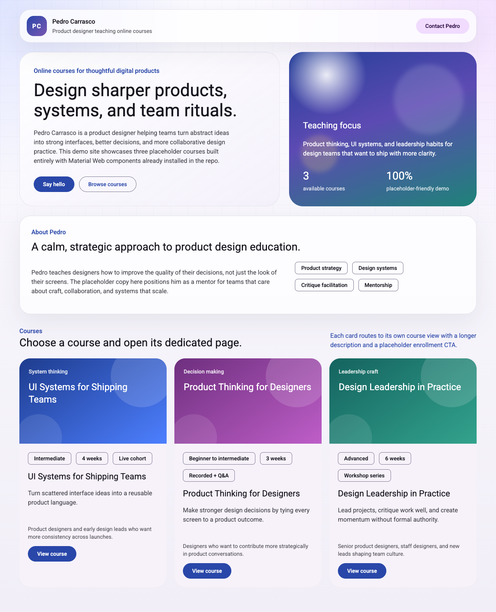

# UI Inspection

## Screenshot

## View metadata

- Platform: web
- Source kind: repo-view
- Source path or URL: `http://127.0.0.1:4173/#/`
- Screenshot path: `Design system audit/home/pages/home/screenshots/home.png`
- Screenshot provenance: Full-page browser automation capture of the local Vite render for `#/`
- Capture method: `npm run dev -- --host 127.0.0.1 --port 4173` plus `agent-browser screenshot --full`
- Goal: Inspect `/#` and update the existing Material DS kit with screenshot-grounded evidence
- Repo path: `src/main.js`, `src/style.css`
- Route or entry view: `#/`

## Page or screen purpose

This route acts as the course landing page. It introduces Pedro Carrasco, establishes the tone of the teaching offer, and gives visitors three course cards that route into dedicated detail pages.

## Structural breakdown (top to bottom)

1. `header.site-header`
   - Left-aligned brand lockup with `.brand-mark` and `.brand-copy`
   - Right-aligned contact CTA wrapped in `.site-actions`
2. `section.hero-section`
   - `.hero-copy-block` with eyebrow, display heading, descriptive paragraph, and two CTA buttons
   - `.hero-panel` with decorative orb layer, short supporting copy, and two stat blocks
3. `section.about-section.surface-panel`
   - `.section-heading` introducing the teacher
   - `.about-grid` with a long-form paragraph on the left and a chip cluster in `.about-chips` on the right
4. `section.courses-section#courses`
   - `.section-heading.section-heading-inline` with a section intro and supporting copy
   - `.course-grid` containing three repeated `.course-card` items
5. Each `.course-card`
   - Color-coded `.course-visual`
   - `.course-card-body` with `.course-meta` assist chips, course title, short tagline, supporting audience text, and a primary CTA

## Component inventory

### Component: md-filled-tonal-button

Source of name

Stable repo-backed custom element tag imported from `@material/web/button/filled-tonal-button.js`.

Where it appears

- Header contact CTA in `header.site-header`

Structure

- Anchor wrapper `.button-link`
- One `md-filled-tonal-button` with text content `Contact Pedro`

Variants

- Single observed label variant on this screen: `Contact Pedro`

Usage

- Used as a secondary-but-prominent utility action in the persistent header

Repetition

- Appears once on this screen

Evidence handles

- Screenshot: `Design system audit/home/pages/home/screenshots/home.png`
- Source: `src/main.js`
- Rendered DOM signal: `md-filled-tonal-button` inside `.site-actions`

Design system mapping

- Mapping status: mapped
- Evidence source: repo signal
- Library or system name: Material Web
- Component name: Filled tonal button
- Code target: `@material/web/button/filled-tonal-button.js` via `md-filled-tonal-button`
- Notes: Mapping is explicit from the import path and rendered custom element tag

### Component: md-filled-button

Source of name

Stable repo-backed custom element tag imported from `@material/web/button/filled-button.js`.

Where it appears

- Hero primary CTA `Say hello`
- Each course card CTA `View course`

Structure

- Anchor wrapper `.button-link`
- One `md-filled-button` with short CTA text

Variants

- `Say hello`
- `View course`

Usage

- Carries the highest emphasis action in both hero and card contexts

Repetition

- Appears four times on this screen

Evidence handles

- Screenshot: `Design system audit/home/pages/home/screenshots/home.png`
- Source: `src/main.js`
- Rendered DOM signal: four `md-filled-button` elements on `#/`

Design system mapping

- Mapping status: mapped
- Evidence source: repo signal
- Library or system name: Material Web
- Component name: Filled button
- Code target: `@material/web/button/filled-button.js` via `md-filled-button`
- Notes: Same component is reused for page-level and card-level primary actions

### Component: md-outlined-button

Source of name

Stable repo-backed custom element tag imported from `@material/web/button/outlined-button.js`.

Where it appears

- Hero secondary CTA `Browse courses`

Structure

- Anchor wrapper `.button-link`
- One `md-outlined-button`

Variants

- Single observed text variant: `Browse courses`

Usage

- Pairs with a filled primary CTA to provide a lower-emphasis navigation option

Repetition

- Appears once on this screen

Evidence handles

- Screenshot: `Design system audit/home/pages/home/screenshots/home.png`
- Source: `src/main.js`
- Rendered DOM signal: `md-outlined-button` in `.hero-actions`

Design system mapping

- Mapping status: mapped
- Evidence source: repo signal
- Library or system name: Material Web
- Component name: Outlined button
- Code target: `@material/web/button/outlined-button.js` via `md-outlined-button`
- Notes: Used as the only low-emphasis CTA on the landing page

### Component: md-assist-chip

Source of name

Stable repo-backed custom element tag imported from `@material/web/chips/assist-chip.js`.

Where it appears

- About highlight cluster in `.about-chips`
- Course metadata cluster in each `.course-card .course-meta`

Structure

- Standalone `md-assist-chip` elements
- Labels are set through the `label` attribute rather than slotted text

Variants

- Topical highlight labels: `Product strategy`, `Design systems`, `Critique facilitation`, `Mentorship`
- Metadata labels: level, duration, and format values for each course card

Usage

- Encodes lightweight metadata and topical tags without dominating the layout

Repetition

- Appears thirteen times on this screen

Evidence handles

- Screenshot: `Design system audit/home/pages/home/screenshots/home.png`
- Source: `src/main.js`
- Rendered DOM signal: `md-assist-chip` in `.about-chips` and `.course-meta`

Design system mapping

- Mapping status: mapped
- Evidence source: repo signal
- Library or system name: Material Web
- Component name: Assist chip
- Code target: `@material/web/chips/assist-chip.js` via `md-assist-chip`
- Notes: The same component supports both topical tags and structured course metadata

### Component: md-elevated-card

Source of name

Stable repo-backed custom element tag imported from `@material/web/labs/card/elevated-card.js`.

Where it appears

- Wrapper for each course card in `.course-grid`

Structure

- Outer `md-elevated-card.course-card`
- Contains `.course-visual` and `.course-card-body`

Variants

- Three observed visual variants driven by modifier classes on `.course-visual`
- `course-visual-ui-systems`
- `course-visual-product-thinking`
- `course-visual-design-leadership`

Usage

- Provides the main repeated content container for course offerings on the landing page

Repetition

- Appears three times on this screen

Evidence handles

- Screenshot: `Design system audit/home/pages/home/screenshots/home.png`
- Source: `src/main.js`
- Rendered DOM signal: three `md-elevated-card.course-card` elements

Design system mapping

- Mapping status: mapped
- Evidence source: repo signal
- Library or system name: Material Web
- Component name: Elevated card
- Code target: `@material/web/labs/card/elevated-card.js` via `md-elevated-card`
- Notes: The Material card is combined with custom internal layout and illustration classes

## Repeated patterns

- The page reuses rounded white or translucent surfaces with large radii and soft borders for header, about, and course modules
- Primary and secondary CTA pairs appear as a filled action plus a lower-emphasis tonal or outlined action
- Metadata is consistently compressed into assist-chip clusters
- The three course cards repeat the same internal structure while changing only copy and `.course-visual-*` modifier classes

## Layout observations

- The layout is constrained by `.page-shell` and uses generous spacing between stacked sections
- `hero-section` uses a two-column grid with a large copy panel and a visual/stat panel
- `about-grid` switches from text-plus-chip layout to a single column at narrower breakpoints according to `src/style.css`
- `course-grid` is a three-column layout on desktop and collapses to one column in the mobile media query

## Notes

- Screenshot evidence was captured from the local Vite dev server, not from static source inspection alone
- The page title at capture time was `Pedro Carrasco | Product Design Courses`
- Stable component naming comes from explicit Material Web imports and rendered custom element tags
