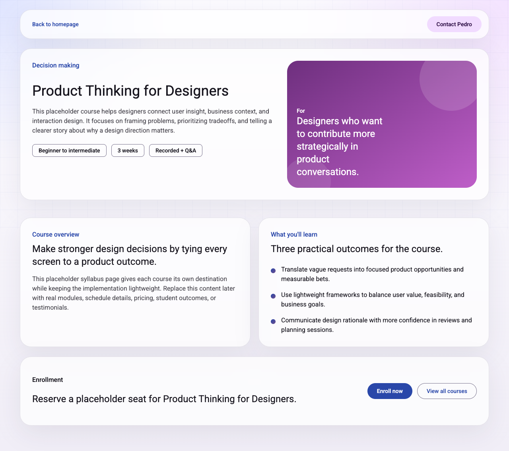

# UI Inspection

## Screenshot

## View metadata

- Platform: web
- Source kind: repo-view
- Source path or URL: `http://127.0.0.1:4173/#/courses/product-thinking`
- Screenshot path: `Design system audit/home/pages/product-thinking/screenshots/product-thinking.png`
- Screenshot provenance: Full-page browser automation capture of the local Vite render for `#/courses/product-thinking`
- Capture method: `npm run dev -- --host 127.0.0.1 --port 4173` plus `agent-browser screenshot --full`
- Goal: Inspect `/#/courses/product-thinking` and update the existing Material DS kit with screenshot-grounded evidence
- Repo path: `src/main.js`, `src/style.css`
- Route or entry view: `#/courses/product-thinking`

## Page or screen purpose

This route is the dedicated detail page for the Product Thinking course. It expands the course description, shows lightweight metadata, presents learning outcomes, and ends with an enrollment call to action.

## Structural breakdown (top to bottom)

1. `header.site-header.detail-header`
   - Left-aligned back navigation link rendered as a text button
   - Right-aligned contact CTA rendered as a filled tonal button
2. `section.detail-hero.surface-panel`
   - `.detail-copy` with eyebrow, `h1`, descriptive paragraph, and `.course-meta.detail-meta`
   - `.detail-visual.course-visual-product-thinking` used as a branded audience panel
3. `section.detail-content`
   - Two side-by-side `.surface-panel.detail-panel` blocks
   - Left panel is a course overview paragraph
   - Right panel is a three-item outcomes list with `.outcome-item` rows
4. `section.enrol-section.surface-panel`
   - Short enrollment copy block on the left
   - `.enrol-actions` CTA pair on the right

## Component inventory

### Component: md-text-button

Source of name

Stable repo-backed custom element tag imported from `@material/web/button/text-button.js`.

Where it appears

- Header back-navigation action `Back to homepage`

Structure

- Anchor wrapper `.button-link`
- One `md-text-button`

Variants

- Single observed text variant: `Back to homepage`

Usage

- Provides the lightest-emphasis action on the page for returning to the landing page

Repetition

- Appears once on this screen

Evidence handles

- Screenshot: `Design system audit/home/pages/product-thinking/screenshots/product-thinking.png`
- Source: `src/main.js`
- Rendered DOM signal: `md-text-button` in `.detail-header`

Design system mapping

- Mapping status: mapped
- Evidence source: repo signal
- Library or system name: Material Web
- Component name: Text button
- Code target: `@material/web/button/text-button.js` via `md-text-button`
- Notes: The component is used for low-friction return navigation rather than for form submission or enrollment

### Component: md-filled-tonal-button

Source of name

Stable repo-backed custom element tag imported from `@material/web/button/filled-tonal-button.js`.

Where it appears

- Header contact CTA `Contact Pedro`

Structure

- Anchor wrapper `.button-link`
- One `md-filled-tonal-button`

Variants

- Single observed label variant on this screen: `Contact Pedro`

Usage

- Maintains a consistent utility CTA between the home page and the detail page header

Repetition

- Appears once on this screen

Evidence handles

- Screenshot: `Design system audit/home/pages/product-thinking/screenshots/product-thinking.png`
- Source: `src/main.js`
- Rendered DOM signal: `md-filled-tonal-button` in `.detail-header`

Design system mapping

- Mapping status: mapped
- Evidence source: repo signal
- Library or system name: Material Web
- Component name: Filled tonal button
- Code target: `@material/web/button/filled-tonal-button.js` via `md-filled-tonal-button`
- Notes: Visual treatment is consistent with the header CTA on the landing page

### Component: md-assist-chip

Source of name

Stable repo-backed custom element tag imported from `@material/web/chips/assist-chip.js`.

Where it appears

- `.course-meta.detail-meta` beneath the course description

Structure

- Three standalone `md-assist-chip` elements with `label` attributes

Variants

- `Beginner to intermediate`
- `3 weeks`
- `Recorded + Q&A`

Usage

- Presents course metadata in a compact, scan-friendly cluster directly below the hero copy

Repetition

- Appears three times on this screen

Evidence handles

- Screenshot: `Design system audit/home/pages/product-thinking/screenshots/product-thinking.png`
- Source: `src/main.js`
- Rendered DOM signal: `md-assist-chip` elements in `.course-meta.detail-meta`

Design system mapping

- Mapping status: mapped
- Evidence source: repo signal
- Library or system name: Material Web
- Component name: Assist chip
- Code target: `@material/web/chips/assist-chip.js` via `md-assist-chip`
- Notes: This is the detail-page metadata expression of the same chip component used more broadly on the home route

### Component: md-filled-button

Source of name

Stable repo-backed custom element tag imported from `@material/web/button/filled-button.js`.

Where it appears

- Enrollment primary CTA `Enroll now`

Structure

- Anchor wrapper `.button-link`
- One `md-filled-button`

Variants

- Single observed text variant on this screen: `Enroll now`

Usage

- Serves as the highest-emphasis action in the enrollment band

Repetition

- Appears once on this screen

Evidence handles

- Screenshot: `Design system audit/home/pages/product-thinking/screenshots/product-thinking.png`
- Source: `src/main.js`
- Rendered DOM signal: `md-filled-button` inside `.enrol-actions`

Design system mapping

- Mapping status: mapped
- Evidence source: repo signal
- Library or system name: Material Web
- Component name: Filled button
- Code target: `@material/web/button/filled-button.js` via `md-filled-button`
- Notes: Same component family as the hero and card CTAs on the home route, but used here for transactional enrollment emphasis

### Component: md-outlined-button

Source of name

Stable repo-backed custom element tag imported from `@material/web/button/outlined-button.js`.

Where it appears

- Secondary enrollment/navigation CTA `View all courses`

Structure

- Anchor wrapper `.button-link`
- One `md-outlined-button`

Variants

- Single observed text variant: `View all courses`

Usage

- Provides the lower-emphasis alternative to the primary enrollment action

Repetition

- Appears once on this screen

Evidence handles

- Screenshot: `Design system audit/home/pages/product-thinking/screenshots/product-thinking.png`
- Source: `src/main.js`
- Rendered DOM signal: `md-outlined-button` inside `.enrol-actions`

Design system mapping

- Mapping status: mapped
- Evidence source: repo signal
- Library or system name: Material Web
- Component name: Outlined button
- Code target: `@material/web/button/outlined-button.js` via `md-outlined-button`
- Notes: Mirrors the secondary CTA behavior used in the landing-page hero

## Repeated patterns

- The detail page continues the same rounded translucent shell language established on the home route
- CTA pairs again use a stronger filled action next to a lighter alternative
- Metadata remains encoded as assist chips rather than plain text lists
- The two `.detail-panel` blocks share the same spacing, border radius, and heading structure

## Layout observations

- The page keeps a single-column shell but uses nested grids for the hero and the two detail panels
- `detail-hero` is a two-column split between copy and a branded visual audience panel
- `detail-content` is a two-column grid that collapses to one column under the responsive rules in `src/style.css`
- The enrollment section uses a left/right flex layout so the CTA pair sits opposite the copy on larger screens

## Notes

- Screenshot evidence was captured from the local Vite dev server, not inferred from source only
- The page title at capture time was `Product Thinking for Designers | Pedro Carrasco Courses`
- The rendered route stayed on `#/courses/product-thinking` for the final inspection capture
